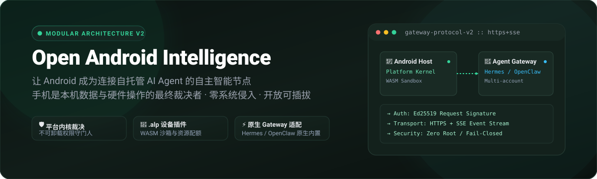
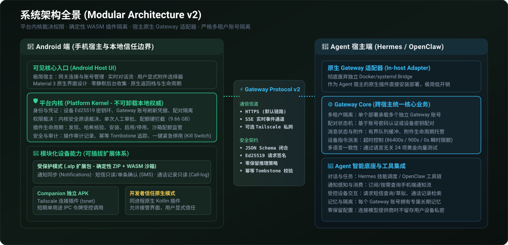
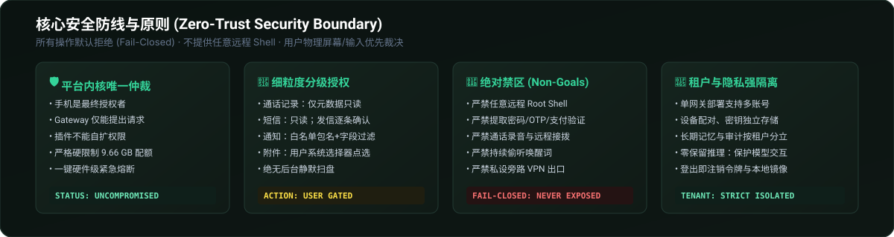

<div align="center">



<p align="center">
  <strong>让 Android 手机安全连接到自托管 AI Agent · 手机是本机数据与设备操作的最终裁决者</strong>
</p>

<p align="center">
  <a href="#-项目目的"></a>
  <a href="#-快速上手与使用方法"></a>
  <a href="#-当前实现与验证状态"></a>
  <a href="#-安全模型与设计底线"></a>
  <a href="LICENSE"></a>
</p>

</div>

---

## 📖 项目目的

**open-android-intelligence** 为 Android 设备与用户自托管的 AI Agent（如 Hermes、OpenClaw 等）建立起一条**完全去中心化、细粒度可授权、基于安全沙箱与强隔离的通信与能力协作桥梁**，用于取代即时通讯软件作为agent连接器。同时可提供安卓本地命令执行，手机操控能力，无需依赖手机厂或其他第三方 Agent 服务提供商

### 核心设计原则
- **客户端仅负责连接Agent端网关**：所有模型、工具调用，agent编排等均由远程自部署Agent负责，客户端仅负责通信与命令执行

- **手机是本地信任边界的最终裁决者**：Agent、Gateway、设备插件和模型输出均仅能发起“请求”；手机端的不可卸载平台内核（Platform Kernel）及用户本人，始终拥有最终决定权与拒绝权。

- **极简宿主与纯模块化解耦**：Android 宿主仅保留对话交互、网关连接与用户主动选择的附件上传；电话、短信、通知等业务能力彻底解耦为独立插件，按需加载、即用即审。

---

## 🏛️ 最新架构全景

项目采用 **模块化插件架构（Modular Plugin Architecture）** 与 **Gateway Protocol v2**。

<div align="center">
  
</div>

### 1. Android 端架构分层

- **可见核心（Android Host）**：
  - 基于现代 Material 3 原生规范打造的界面交互体系，支持官方 Dynamic Color 与符合物理直觉的流体动效；
  - 提供 Gateway 账号登录、连接管理、实时多线程会话流管理（Workbench / Thread Drawer / Assistant Session）；
  - 承载经过严格鉴权校验的用户主动附件上传（通过系统 Photo Picker / SAF 系统选择器，严禁静默扫盘）。
- **不可卸载平台内核（Platform Kernel）**：
  - 手机端的常驻本地权威，掌管设备身份（Ed25519 密钥环）与 Gateway 账号刷新凭据；
  - 固化内核安全原语，统一裁决所有敏感操作与人工确认阻断；
  - 掌管设备插件的完整生命周期（验证、安装、配额管理、安全隔离、启停、回滚与卸载）；
  - 维护物理级一键紧急熔断机制（Kill Switch）与操作审计日志。
- **模块化插件体系（Device Plugins）**：
  - **受保护模式（Protected Plugins）**：基于 WebAssembly（WASM）运行时沙箱隔离的 `.alp` 标准插件包，采用 RFC 8785 确定性封装与作者签名防伪，运行时受严格 CPU、内存、存储配额硬限制；
  - **Companion 独立 APK**：用于满足系统包络外权限与深层进程隔离需求（如 Tailscale Companion 插件，利用 tsnet 提供用户态无缝私网通道，绝不占用系统 VPN 槽位）；
  - **开发者信任原生模式（Native Plugins）**：同进程原生扩展，需用户显式信任，支持版本化原生界面接管。

### 2. 网关协议与传输层（Gateway Protocol v2）

- **标准 HTTPS + SSE 管道**：基于端到端 HTTPS 双向传输与 Server-Sent Events 流式事件下发；
- **封闭契约规范**：全线基于 JSON Schema 2020-12，全字段封闭校验，拒绝未知字段；
- **Ed25519 请求签名**：每个关键请求均附带防重放时间戳、一次性随机数与设备/网关端签名；
- **幂等状态机**：操作具备确定性 Tombstone 生命周期与有界重试，杜绝网络抖动造成的重复操作。

### 3. Agent 宿主端适配层

- **原生嵌入式适配器（In-host Gateway Adapter）**：
  - 告别过去需要独立运行 Docker/systemd Bridge 的历史，Hermes 与 OpenClaw 直接通过原生插件方式加载适配器；
- **多账号与多租户隔离**：
  - 单个适配器部署支持托管多个彼此独立的 Gateway 账号；
  - 各账号的配对设备、会话记录、消息状态、长期记忆与密钥物理隔离；
- **零保留（Zero-Retention）推理支持**：
  - 与模型提供方交互遵循隐私合规与零留存原则，不留下用户设备私密资产持久副本。

---

## 🛡️ 安全模型与设计底线

<div align="center">
  
</div>

| 能力维度 | 授权策略与安全边界 |
| --- | --- |
| **通话记录** | 仅元数据只读；严禁通话录音、远程转写、接听、挂断或自动拨号 |
| **短信交互** | 接收与历史查询受限可读；短信发送**必须逐条经过屏幕人工确认** |
| **通知同步** | 默认空白名单 + 仅元数据级；支持包名/字段精细控制；加密出站缓冲，拒绝明文落盘 |
| **文件与媒体** | 仅限用户在手机端通过系统 Photo Picker / SAF 文件选择器主动选择提交，严禁后台扫描文件系统 |
| **网络穿透** | Tailscale tsnet 运行于用户态；不占用 Android VPN 通道，不提供通用代理或旁路路由 |
| **存储配额** | 严格硬逻辑配额限制（9,663,676,416 字节），超限坚决拒绝而非静默覆写 |

---

## 📦 项目目录结构

```text
open-android-intelligence/
├── apps/android/                     # Android 原生宿主工程（AGP 8.9.2, SDK 35, Kotlin 2.1.20）
│   ├── app/                          # 主入口 APK（宿主交互、平台设置、网关连接）
│   ├── platform-kernel/              # 不可卸载平台内核（权限仲裁、插件生命周期、安全原语）
│   ├── plugin-package/               # .alp 插件包解析、Ed25519 验签与安装器
│   ├── plugin-runtime-wasm/          # WebAssembly 沙箱运行时
│   ├── conversation-ui/              # 原生 Material 3 会话界面组件库
│   ├── assistant-holder/             # 系统助手角色承载与全局触发 APK
│   ├── tailscale-companion/          # 可选 Tailscale 连接插件 Companion APK
│   └── ...                           # 领域模型、数据存储与契约端口模块
├── gateway-contract/                 # Gateway Protocol v2 核心契约与双宿主一致性套件
│   ├── schemas/                      # 严谨封闭的 JSON Schema 2020-12 协议定义
│   ├── vectors/                      # 语言无关的跨宿主黄金测试向量（24 例）
│   ├── src/                          # TypeScript 契约实现（Schema 编译、请求签名校验、状态机）
│   └── tools/                        # Hermes (Python) 与 OpenClaw (TS) 一致性执行套件
├── plugins/                          # 官方第一方参考设备插件（遵循 .alp 规范构建）
│   ├── notifications/                # 策略驱动通知采集插件源码（Rust/WASM）
│   ├── sms/                          # 短信查询与确认发送插件源码（Rust/WASM）
│   ├── call-log/                     # 通话记录元数据只读插件源码（Rust/WASM）
│   ├── sdk-rust/                     # 设备插件官方 Rust SDK
│   └── dist/                         # 确定性构建生成的 .alp 标准产物包
├── plugin-tooling/                   # 设备插件构建与签名工具链（确定性打包器）
├── integrations/                     # Agent 宿主适配器集成
│   ├── hermes/                       # Hermes Python 原生网关适配器（open_android_intelligence_gateway）
│   └── openclaw/                     # OpenClaw 原生网关适配器插件
├── hermes-account.py                 # Hermes 网关本地多账号命令行管理工具
├── docs/                             # 规范文档、ADR 架构决策与实施计划
└── legacy/                           # 已冻结归档的旧 Bridge 与历史组件
```

---

## 🚀 快速上手与使用方法

### 1. 环境准备

- **Node.js**：`>= 24.18.0`（推荐使用 nvm）
- **Python**：`>= 3.12`
- **JDK**：`JDK 17` 或更高
- **Android SDK**：`compileSdk 35`, `minSdk 34`

### 2. 协议契约与跨宿主一致性校验

在根目录执行 Gateway Protocol v2 的多语言一致性测试（同时覆盖 TypeScript 与 Python 双端）：

```bash
# 安装基础依赖
npm install

# 运行跨宿主网关一致性测试（Hermes + OpenClaw 24/24 向量一致性全绿）
npm run gateway:v2:conformance
```

### 3. Agent 端 Hermes 网关账号配置

项目提供了开箱即用的命令行工具 `hermes-account.py`，用于快速完成 Hermes 网关初始化与多账号生命周期管理：

```bash
# 步骤 1：生成 0600 受限主密钥文件（遵循 ADR 0023 规范）
./hermes-account.py init-key

# 步骤 2：创建 Gateway 账号（支持为不同用户创建独立隔离的网关上下文）
./hermes-account.py create my_user
# 按照终端交互提示设置强密码，或保存自动生成的账号刷新凭证

# 步骤 3：查看网关当前托管状态与配对概况
./hermes-account.py status
```

### 4. 构建官方设备插件包（.alp）

你可以使用项目自带的确定性构建工具打包设备插件：

```bash
cd plugin-tooling
npm install
npm run build:references
```
构建产物将输出在 `plugins/dist/` 目录下：
- `org.agentlife.notifications-1.0.0.alp`
- `org.agentlife.sms-1.0.0.alp`
- `org.agentlife.call-log-1.0.0.alp`

### 5. Android 宿主编译

进入 Android 工程目录，执行模块检查与调试包编译：

```bash
cd apps/android
./gradlew --no-daemon :app:assembleDebug
```

---

## 📊 当前实现与验证状态

项目坚持真实测试闭环与“逐步完成”原则，所有状态以实际机读与运行门禁为准：

| 验证领域 | 门禁规范与证据 | 状态 |
| --- | --- | --- |
| **Gateway Protocol v2 跨宿主契约** | `gateway-contract` 24 项跨语言（TS/Python）黄金向量 | ✅ **PASS (24/24 全绿)** |
| **Hermes 原生网关适配器** | `integrations/hermes` 单元与集成测试 | ✅ **PASS** |
| **OpenClaw 适配器插件** | `integrations/openclaw` 运行时及 Schema 验证 | ✅ **PASS** |
| **设备插件确定性打包器** | `plugin-tooling` RFC 8785 标准 ZIP 容器 | ✅ **PASS** |
| **官方参考插件构建** | 通知、短信、通话记录三款 .alp 真实输出产物 | ✅ **READY** |
| **Android 核心架构实现** | Platform Kernel、WASM 运行时集成、Material 3 界面 | ✅ **READY** |
| **物理真机无缝网络全链路** | 依赖特定物理设备网络环境及 Rootless tsnet 连通性测试 | ⏳ **PENDING (推进中)** |

---

## 🗺️ 待完成功能与发展路线（Roadmap）

- [ ] **物理设备端到端（E2E）深度闭环**：
  - 适配 Android 系统物理助手按键与全面屏长按手势的无缝呼出体验。
- [ ] **扩充官方 WASM 受保护插件生态**：
  - 引入联系人受控只读插件；
  - 引入日历与系统闹钟受控写入插件（需逐次确认）；
  - 引入传感器低频聚合与按需采样插件；
  - 引入无障碍屏幕语义树（Accessibility Node Tree）按需解析插件。
- [ ] **去中心化插件索引与生态分发**：
  - 构建轻量化、支持 Ed25519 签名链核验的插件市场元数据索引；
  - 支持用户直接从自定义 URL 或 GitHub Release 导入并验证安装 `.alp` 插件包。
- [ ] **端侧双向全双工流式语音交互**：
  - 支持 WebSocket/WebRTC 备用低延迟全双工音频通路；
  - 接入端侧轻量化语音活动检测（VAD）与打断机制。
- [ ] **多设备漫游与 Gateway 多账号热切换**：
  - 优化一台手机在多个自托管 Gateway（如家庭服务器、办公私有云）之间的零感知秒级切换体验。

---

## 🤝 贡献与规范

欢迎参与 open-android-intelligence 的建设！在提交代码前，请务必阅读以下文档：

- 领域术语与设计边界：[`CONTEXT.md`](CONTEXT.md)
- 架构演进总规格：[`docs/superpowers/specs/2026-08-24-modular-plugin-architecture.md`](docs/superpowers/specs/2026-08-24-modular-plugin-architecture.md)
- Gateway Protocol v2 契约：[`docs/contracts/gateway-protocol-v2.md`](docs/contracts/gateway-protocol-v2.md)
- 设备插件包规范：[`docs/contracts/device-plugin-package-v1.md`](docs/contracts/device-plugin-package-v1.md)
- Agent 行为规范与提交原则：[`AGENTS.md`](AGENTS.md)

---

## 📄 许可证

本项目基于 [MIT 许可证](LICENSE) 开源。
