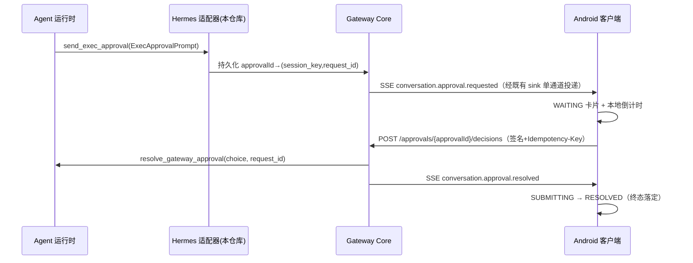

## 产品概述
把「命令执行审批」从「在输入框手打 `/approve` / `/deny`」的纯文本交互，改造为端到端的**结构化交互式审批卡片**：Agent 需要执行可疑命令时，网关下发一张带可疑命令预览、告警原因、倒计时与内联按钮的卡片气泡到手机会话时间线；用户点按钮即通过独立网关接口提交决策，立即解除后端 Agent 的命令阻塞，不再以普通消息模拟命令。

## 核心功能
1. **结构化审批下发**：网关下发审批请求卡片（命令预览 + 告警描述 + 可选项 + 超时秒数，默认 300 秒），选项集合由服务端下发，客户端不硬编码档位。
2. **一键决策与即时 ACK**：卡片内联按钮（`允许一次`=Primary、`始终允许`=Secondary、`拒绝`=Destructive）提交结构化决策；点击后整组按钮立即锁定，选中项显示微型进度指示器、其余置灰，带来"已受理"的即时反馈。
3. **倒计时徽标与本地超时**：卡片右上角实时倒计时徽标（如 `⏱️ 285s`），归零后按钮全部禁用置灰并显示"审批已超时"。
4. **闭环状态机**：等待中 / 已允许 / 已拒绝 / 已超时四态与会话时间线正确合并——切出再进入会话不重复弹出、不重置倒计时，重连重放不把已落定的卡片弹回"等待中"。
5. **诚实降级**：不支持卡片能力的网关继续沿用文本 `/approve` 通道；不支持时不显示空卡片，提交失败如实回滚为可重试状态并给出结构化提示。


## 技术栈
- **Android**：Kotlin 2.1.20 + Jetpack Compose（Material3，BOM 2024.12.01），模块 `conversation-ui` / `conversation-domain` / `conversation-data` / `gateway-client` / `app`。
- **契约**：JSON Schema 2020-12（`gateway-contract/schemas`）+ 共享向量（`gateway-contract/vectors`）+ vitest 一致性套件。
- **宿主**：Hermes（Python 平台适配器，复用 `BasePlatformAdapter._send_exec_approval_prompt` 与 `tools.approval.resolve_gateway_approval`）、OpenClaw（TypeScript，本轮不声明能力位）。

## 实现路径与关键裁决

**整体策略**：以「宿主权威 + 客户端呈现」为轴。宿主把 exec-approval 从文本消息改造为结构化事件下发，并提供独立决策端点；Android 只做呈现、倒计时与乐观反馈，所有终态以网关事件为准。

1. **交互句柄用 `approvalId`，不下发 `session_key`**
   - 契约 §7.1 已确立"宿主内部标识不下发客户端"（`agentSessionId`）。因此协议只下发 `approvalId` + `conversationId` + 选项，宿主侧在账号库持久化 `approvalId → (session_key, request_id)` 映射，决策端点据此调用 `resolve_gateway_approval(session_key, choice, request_id=…)`。
   - 收益：客户端无法伪造任意 session 的审批；宿主重启后（审批事件仍在手机端）迟到决策仍可解析；撤回走 `withdraw_gateway_approval(session_key, request_id, cause)`。

2. **词表统一为宿主原生 `once | session | always | deny`**
   - QQ 侧 `allow-once|allow-always|deny` 与 `resolve_gateway_approval` 的 `once|session|always|deny` 是两套词表，协议层**只采用一套**：choice 用 `once|session|always|deny`；`resolved` 的 outcome 追加 `timeout` / `withdrawn` 两个终态。Android 端把 choice 映射为中文标签与 `primary`/`secondary`/`danger` 样式（服务端下发的 `label`/`style` 优先，本地映射仅为兜底）。
   - 客户端渲染可变档位：`smart_denied` 场景宿主只下发 `once`+`deny` 两档，UI 按数量自适应（1~4 个按钮，超过容器宽度自动换行）。

3. **超时：本地置灰是呈现，宿主才是权威**
   - 卡片按 `expiresAt = requestedAt + timeoutSeconds` 本地递减；归零即本地进入 `TIMED_OUT`（置灰 + "审批已超时"），**但终态仍以宿主 `conversation.approval.resolved(decision=timeout)` 为准**——客户端不伪造权威结论，只提前给出"不会再执行"的可读事实。
   - 300 秒默认值为具名常量（`APPROVAL_DEFAULT_TIMEOUT_SECONDS`），首选服务端下发值，客户端常量仅作缺失兜底。

4. **点击即 ACK，失败如实回滚**
   - 状态机单向：`WAITING → SUBMITTING → RESOLVED`；只有提交失败允许 `SUBMITTING → WAITING`（可重试 + `notice` 结构化提示）。成功前绝不把卡片画成"已允许"。
   - 决策请求走既有签名通道 + `Idempotency-Key`（绑定 requestId），重复点击与网络重试天然幂等。

5. **审批卡片是独立时间线行，不是 `MessagePart`**
   - `WorkbenchController` 新增 `pendingApprovals: LinkedHashMap<approvalId, ApprovalCardState>`（带 `conversationId`），`renderTimeline()` 按时间戳把卡片行插入消息序列。理由：审批不是消息正文的一部分，硬塞进 `MessagePart` 会被现有的"按轮折叠 / `pruneConfirmedAssistantDuplicates` / `deduplicateTimelineEntries`"误伤；独立行以 `approval:<id>` 为 key，天然不参与消息去重。
   - 生命周期：`pendingApprovals` **账号级保留**，`openThread()` 清理清单（`generation`/`notice`/composer/`historicalAttachments`）**不清理它**；渲染按当前 `conversationId` 过滤，因此切回会话卡片原样出现、倒计时不重置。终态行按 LRU 上限（32 条）保留，保证"重进会话仍看到已允许/已拒绝"。
   - 重放保护：复用既有 `handledEventIds`；且状态机禁止 `RESOLVED → WAITING`，重连重放不会复活卡片。

6. **Hermes 投递不改道**：审批事件仍走 `EventStore.append → AccountStore.record_event → COMMIT 后 _flush_events()`，投递唯一入口仍是 `adapter._enqueue_frame`，不新增第二条投递路径；回滚/提交结果未知直接丢弃。

## 工程要点（防回归）
- **契约改动的三方联动**：改 `schemas/*.json` 必须重算 core schema 摘要（当前 `sha256:f0eb3265…`）并同步 Kotlin `SchemaContractHash.CORE`、OpenClaw `plugin-manifest.json#capabilitySchemaHash`、契约 §16。
- **共享 fixture 5 → 7 的 7 处同步**（含最易漏的 Android `DispatchedSchemaRegistry.EXPECTED_ENTRY_COUNT` 与 `DispatchedSchemaVectorTest` 两处断言、`docs/mvp/gateway-v2-conformance.md`）；共享 dispatched-schema 禁用 `if/then/else/not`，对象节点必须 `additionalProperties:false`，条件形状用 `oneOf` 双分支。
- **性能**：倒计时 tick 必须局限在卡片内部（`produceState`/`LaunchedEffect` 局部重组），不得让整条时间线每秒重组；`pendingApprovals` 有界；`observeEvents` 单订阅不变。
- **Kotlin 改动本机不编译**：CI 的 `e: file:///…` 行是唯一编译反馈，提交后必须跟踪 `ci.yml` / `android-apk.yml` / Nightly 三个 workflow。
- **conversation-ui 测试陷阱**：结尾 `controller.cancel()`；非超时用例关掉看门狗或改用 `advanceTimeBy`；倒计时用可注入时钟而非真实 sleep。

## 架构与数据流


## 目录结构

```
docs/contracts/gateway-protocol-v2.md                         # [MODIFY] §4 新增 agent-approval-cards-v1；新增 §7.2 审批交互（事件载荷、决策端点、幂等、超时权威）；§9 事件类型 +2；§14 错误码 +3；§16 fixture 清单 +2
gateway-contract/schemas/negotiate.schema.json               # [MODIFY] request/response 两处 conversationUi enum 加 agent-approval-cards-v1
gateway-contract/schemas/event.schema.json                   # [MODIFY] type.enum 加 conversation.approval.requested / .resolved
gateway-contract/vectors/dispatched-schema-fixtures.json      # [MODIFY] +2 个 fixture（requested/resolved）
gateway-contract/vectors/dispatched-schema-fixtures-1.0.0.schema.json # [MODIFY] catalogEntries 与 bindings 两处 min/max 5→7
gateway-contract/vectors/sse-events.json                     # [MODIFY] +2 例（正常下发 / 超时 resolved）
gateway-contract/test/dispatched-schema-validator.test.ts    # [MODIFY] 三个数组 + 两处 toHaveLength
gateway-contract/test/golden-vectors.test.ts                 # [MODIFY] 两处数量
docs/mvp/gateway-v2-conformance.md                           # [MODIFY] runner 步骤数量

integrations/hermes/open_android_intelligence_gateway/adapter.py  # [MODIFY] 覆盖 _send_exec_approval_prompt：转结构化事件（不经 send() 文本）；撤回与不可渲染兜底
integrations/hermes/open_android_intelligence_gateway/core.py     # [MODIFY] 新增 approval 落库/映射持久化表、决策处理（幂等+resolve）、审批端点分派、超时 resolved 追加
integrations/hermes/open_android_intelligence_gateway/http.py     # [MODIFY] 注册审批决策路由；_ERROR_STATUS 加 APPROVAL_* 错误码
integrations/hermes/open_android_intelligence_gateway/plugin.py    # [MODIFY] 声明 agent-approval-cards-v1
integrations/hermes/tests/test_command_approval_cards.py           # [NEW] 下发/决策/幂等/超时/撤回用例
integrations/hermes/tests/test_account_isolation.py                # [MODIFY] registry 用例计数同步

integrations/openclaw/src/core/shared-vectors.ts              # [MODIFY] EXPECTED_CATALOG_ENTRY_COUNT 5→7
integrations/openclaw/plugin-manifest.json                    # [MODIFY] capabilitySchemaHash 同步
integrations/openclaw/test/gateway-capabilities.test.ts       # [MODIFY] 明确不声明 agent-approval-cards-v1（诚实降级）

apps/android/gateway-client/src/main/kotlin/.../approvals/ApprovalClient.kt   # [NEW] POST /approvals/{id}/decisions（签名通道+Idempotency-Key），返回封闭决策结果
apps/android/gateway-client/src/main/kotlin/.../schema/DispatchedSchemaRegistry.kt # [MODIFY] EXPECTED_ENTRY_COUNT 5→7
apps/android/gateway-client/src/test/kotlin/.../DispatchedSchemaVectorTest.kt      # [MODIFY] 两处断言同步
apps/android/gateway-client/src/test/kotlin/.../ApprovalClientTest.kt              # [NEW] 请求形状/幂等头/错误码映射

apps/android/conversation-domain/.../model/Approval.kt        # [NEW] ApprovalRequest/ApprovalOption/ApprovalChoice/ApprovalDecision/ApprovalOutcome 领域模型（闭集枚举 + 文档化每个字段）
apps/android/conversation-domain/.../ports/ConversationPorts.kt # [MODIFY] VerifiedConversationEvent 加 ApprovalRequested/ApprovalResolved；ConversationRepository 加 submitApprovalDecision（默认实现兼容既有 Fake）
apps/android/conversation-data/.../data/GatewayEventDecoder.kt  # [MODIFY] 两个新事件分支（未知值一律回落 OUTCOME_UNKNOWN，不猜测）
apps/android/conversation-data/src/test/.../GatewayEventDecoderTest.kt # [MODIFY] 解码/未知值/缺字段用例

apps/android/conversation-ui/.../state/ApprovalCardState.kt    # [NEW] 卡片状态机（WAITING/SUBMITTING/RESOLVED/TIMED_OUT）+ 可注入时钟
apps/android/conversation-ui/.../state/WorkbenchController.kt  # [MODIFY] pendingApprovals 状态流、事件合并、决策提交与回滚、renderTimeline 插入卡片行、切会话保留策略
apps/android/conversation-ui/.../workbench/ApprovalCard.kt     # [NEW] 卡片气泡：标题/倒计时徽标/命令预览/告警原因/按钮组/终态行
apps/android/conversation-ui/.../workbench/MessageTimeline.kt  # [MODIFY] 识别卡片行并渲染 ApprovalCard
apps/android/conversation-ui/src/test/.../ApprovalCardTest.kt           # [NEW] Compose 用例：倒计时递减、归零置灰、点击锁定、终态文案
apps/android/conversation-ui/src/test/.../ApprovalStateMachineTest.kt   # [NEW] 状态机用例：提交成功/失败回滚/重放不复活/切会话保留/超时权威
apps/android/app/.../mobile/GatewayRuntime.kt                  # [MODIFY] 按能力位注入 supportsApprovalCards 与 ApprovalClient
```

## 关键结构（接口级）
```kotlin
// conversation-domain/model/Approval.kt
enum class ApprovalChoice { ONCE, SESSION, ALWAYS, DENY, UNKNOWN }   // UNKNOWN：不猜测
enum class ApprovalOutcome { ALLOWED_ONCE, ALLOWED_SESSION, ALLOWED_ALWAYS, DENIED, TIMED_OUT, WITHDRAWN, UNKNOWN }
enum class ApprovalOptionStyle { PRIMARY, SECONDARY, DANGER, NEUTRAL }

data class ApprovalOption(val choice: ApprovalChoice, val label: String?, val style: ApprovalOptionStyle)
data class ApprovalRequest(
    val approvalId: String,
    val conversationId: ConversationId?,
    val command: String,
    val reason: String,
    val severity: String?,
    val options: List<ApprovalOption>,
    val timeoutSeconds: Long,
    val requestedAt: Long,
) {
    val expiresAt: Long get() = requestedAt + timeoutSeconds
}

// 状态机：WAITING → SUBMITTING → RESOLVED（失败才回退 WAITING；TIMED_OUT 为本地呈现态，可被权威 resolved 覆盖）
sealed interface ApprovalCardState {
    data class Waiting(val request: ApprovalRequest, val pendingChoice: ApprovalChoice? = null) : ApprovalCardState
    data class Submitting(val request: ApprovalRequest, val choice: ApprovalChoice) : ApprovalCardState
    data class Resolved(val request: ApprovalRequest, val outcome: ApprovalOutcome, val decidedAt: Long?) : ApprovalCardState
}
```


## 设计风格
沿用会话页既有的 Material 3 动态取色体系（Android 12+ 系统取色优先，回落品牌色），审批卡片作为**独立时间线行**与助手消息同侧左对齐，采用 `surfaceContainerHighest` 抬升的实心卡片 + 细描边，形成"系统请求"而非"聊天内容"的语义层级；标题行带警示图标，右上角倒计时徽标使用等宽字体避免数字跳动。

## 页面：会话页（审批卡片行）
1. **卡片头部**：左侧 `warning` 图标 + "命令需要你的批准"（subheading），右侧倒计时徽标 `⏱️ 285s`；归零后徽标转为"已超时"文案并降低对比度。
2. **命令预览**：深色等宽代码块容器（圆角 8dp、可横向滚动、右上角复制按钮），完整展示被拦截的命令。
3. **告警原因**：正文说明"为何被标记"（如"内联解释器执行"），次要文字色，最多 3 行可展开。
4. **操作按钮组**：底部横向排列 1~4 个按钮（默认三档：允许一次 Primary / 始终允许 Secondary / 拒绝 Destructive），高度 48dp 触控目标；点击后整组锁定，选中项替换为 16dp 微型进度指示器，其余按钮置灰不可点。
5. **终态状态行**：已允许 / 已拒绝 / 已超时用一句话结论 + 功能色图标收尾，按钮组消失，卡片保留在时间线中不可撤销。
6. **降级提示**：网关不支持卡片时，时间线不出现卡片，输入框上方给出"该网关不支持审批卡片，可用 `/approve` 文本命令"的轻量说明条。

## 交互与自适应
- 倒计时每秒局部刷新，仅卡片自身重组；窄屏（<360dp）按钮组自动换行等分。
- 状态切换使用 `MotionSpecs.EmphasizedEasing` 淡入，遵循系统"减少动态效果"降级。
- 卡片宽度与助手气泡一致上限，最大 82–85%，屏幕边距 20dp。


## Agent Extensions
### SubAgent
- **code-explorer**
  - 用途：在动手前精确定位 Hermes `core.py` 路由分派、事件落库与账号库表结构，以及 Android `gateway-client` 签名请求与 `WorkbenchController.renderTimeline` 的插入点，避免凭猜测写路径。
  - 预期产出：一份带文件行号与既有函数签名的接入点清单，供契约层与 Android 状态机实现直接引用。

### Skill
- **code-review**
  - 用途：提交推送后按项目铁律做「标准轴 + 规格轴」两轴独立复审（契约完整性、诚实降级、无伪造实现、Kotlin/设计令牌合规）。
  - 预期产出：两轴复审报告，阻塞项修复并重新验证后才算闭环。
