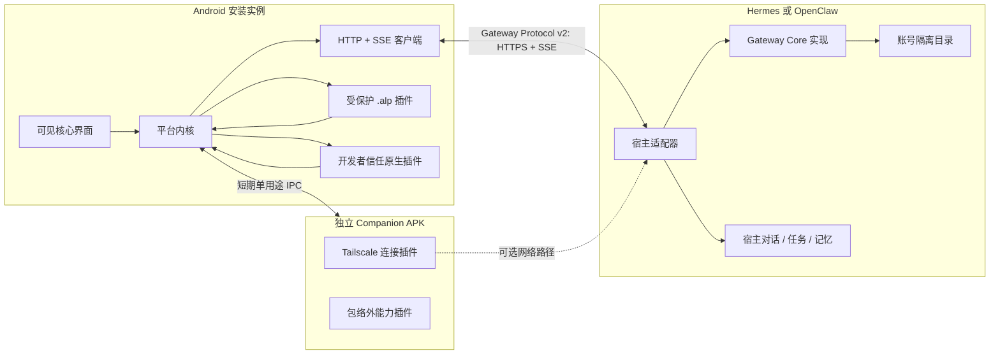

# Open Android Intelligence 模块化插件架构规格

## 1. 权威范围

本文是 Open Android Intelligence 新架构的总规格，规定 Android 宿主、设备插件、Gateway Protocol v2、Hermes/OpenClaw Gateway 适配器及迁移边界。

规范细节分别由以下文件唯一负责：

- 领域术语与边界：`CONTEXT.md`
- 已接受架构决定：`docs/adr/`
- 设备插件安装产物：`docs/contracts/device-plugin-package-v1.md`
- Android 与 Gateway 的网络协议：`docs/contracts/gateway-protocol-v2.md`
- 实施顺序和验收门槛：`docs/superpowers/plans/2026-08-24-modular-plugin-architecture-migration.md`

旧规格继续保留历史背景；发生冲突时以本文、契约和 accepted ADR 为准。旧 Bridge Protocol v1、独立 Bridge 部署及 Tailscale 默认链路不构成兼容要求。

## 2. 产品目标

Open Android Intelligence 让一个 Android 安装实例连接多个用户拥有的 Agent Gateway，通过对话与附件完成核心交互，并由用户按需安装设备能力。

架构必须同时满足：

1. Android 可见核心只包含 Gateway/账号管理、HTTP 连接、对话和附件上传。
2. Android 内保留不可卸载的平台内核，负责身份、插件、权限、隔离、审计和紧急停用。
3. 通知、短信、通话记录、Tailscale 及后续设备能力都不是 App 本体功能。
4. 大多数插件作为受保护的 App 内 `.alp` 包运行；需要包络外权限或原生隔离的插件使用 Companion APK。
5. Agent 端不再部署独立 Docker/systemd Bridge；Hermes 和 OpenClaw 各安装原生 Gateway 适配器。
6. 一个适配器部署可承载多个账号隔离的逻辑 Gateway；每个逻辑 Gateway 只属于一个账号。
7. 项目保持开放：任何作者都能制作、签名和分发插件，不要求中央批准。

## 3. 系统边界

### 3.1 Android 信任边界

平台内核是手机端最终权威。Gateway、Agent、设备插件、Companion 和模型输出都只能提出请求；Android 本地权限、当前设备状态、手机级限制、配对授权和用户确认共同决定请求能否执行。

App 的 Manifest 可以为有限宿主能力包络声明权限和系统组件，但这些声明只让平台内核具备提供安全原语的可能，不代表 App 可见核心实现了对应业务，也不代表任何插件已获授权。

### 3.2 Gateway 信任边界

Gateway Core 负责账号认证、设备配对、协议可靠性、附件暂存、队列和服务端审计。Hermes/OpenClaw 负责 Agent 对话、任务、模型运行与长期记忆。两者通过明确端口交付消息和工具调用，互不冒充对方的数据权威。

### 3.3 中央服务边界

V1 不引入 Open Android Intelligence 中央账号、Relay、Bridge、证书颁发或遥测服务。插件索引可以存在，但它只是可选发现入口，不是信任根或运行依赖。

## 4. Android 宿主

### 4.1 可见核心

主导航固定为：

- 账号与 Gateway：保存多个本地账号资料、切换活动 Gateway、查看连接状态。
- 对话：每个 Gateway 拥有独立的多个对话线程，不合并跨 Gateway 上下文。
- 附件：由用户主动选择并上传图片、文件或音频，Android 可因本机资源或策略拒绝。

插件、权限、安全、审计和开发者信任模式位于设置中的平台管理界面。插件只能贡献声明式设置项、状态卡片和与当前对话相关的动作，不能添加任意顶级导航或 WebView 管理台。

### 4.2 平台内核职责

平台内核固定拥有：

- Android 安装身份、账号资料、配对密钥和刷新凭据保护；
- Gateway Protocol v2 HTTP/SSE 会话与附件传输；
- `.alp` 验证、安装、启用、更新、回滚、隔离和卸载；
- 插件身份、能力依赖、手机级限制和每配对授权；
- WASM 调度、声明式 UI 渲染、资源预算、网络代理和插件私有存储；
- Companion 身份验证、操作令牌和失败关闭；
- Android 权威审计与全局紧急停用。

平台内核不实现通知查询、短信读取、通话记录同步、Tailscale、设备控制或其他可卸载业务能力。

### 4.3 账号保存与自动登录

Android AccountManager 保存非秘密账号资料和秘密引用；Android Keystore 保护设备密钥与账号刷新凭据。密码只在首次登录或凭据失效后输入，不落盘。

应用重启或切换到已登录账号时可以使用刷新凭据自动登录。刷新凭据绑定账号和 Android 安装实例，可轮换、可撤销。自动登录不创建新的插件授权；后台执行还必须拥有目标 Gateway 与插件的后台同步授权。

以下动作必须在界面和 API 中保持不同：

- 退出登录：撤销刷新凭据，保留非秘密账号资料；
- 移除本地账号：退出并清理当前手机上的账号资料、缓存和插件账号数据；
- 解除配对：撤销当前设备配对、密钥、授权和队列；
- 删除 Gateway 账号：高风险确认后删除整个逻辑 Gateway。

### 4.4 连接

直接 HTTPS 是内置默认路径。Android 使用普通请求完成协商、认证、消息和附件操作，使用 SSE 接收流式回复与事件，并以事件游标恢复断线。默认链路必须是 HTTPS；用户显式输入的明文 `http://` 地址是持续警告的降级路径（ADR 0047），它不提供任何可核验的 Gateway 身份，且不允许已固定 TLS 指纹的账号使用。

连接插件只改变“如何到达同一个 HTTPS Gateway”，不能替换 TLS 身份、账号认证、设备配对或应用层授权。Tailscale 作为独立 Companion 插件提供可选路径，默认不安装、不启用。

## 5. 设备插件模型

### 5.1 运行类型

| 类型 | 默认安全状态 | 执行位置 | 适用范围 |
|---|---|---|---|
| 受保护插件 | 允许 | 宿主控制的 WASM 运行时 | 大多数设备能力、连接编排和声明式 UI |
| 原生插件 | 仅开发者信任模式 | Android 宿主进程 | 用户明确完全信任的 Kotlin/DEX/本机代码 |
| Companion 插件 | 安装独立 APK 后允许 | 独立 Android package/process | 包络外权限、系统组件、原生网络栈或独立 UID 隔离 |

受保护模式是默认。进入开发者信任模式前必须说明同进程原生代码可读取宿主已有权限和数据；退出该模式立即停用全部原生插件。

### 5.2 身份、安装与授权

插件身份是 `(namespaced plugin ID, author key)`。作者使用自持 Ed25519 密钥签名确定性 `.alp` 包；首次安装信任作者密钥，后续只有同一身份才能连续更新。

三个状态不可合并：

1. 安装：包内容存在于手机；
2. 启用：插件可以在本机运行；
3. 配对授权：某个 Gateway 可以使用该插件的特定能力。

新安装和新配对默认没有敏感授权。更新若扩大能力、域名、资源、Companion 身份或宿主兼容范围，必须重新批准。

### 5.3 能力和依赖

插件通过作者命名空间声明可提供能力，通过版本范围依赖能力，不导入其他插件代码。平台内核固定定义附件读取、网络访问、后台任务、短信、通知、通话记录、屏幕或控制等安全原语及风险级别。

能力路由支持手机级默认提供者和每 Gateway 覆盖。切换提供者要求重新授权，不能继承旧提供者的权限。

### 5.4 隔离

受保护插件只能通过平台内核端口使用：

- 网络：声明域名、方法和用途的 HTTPS 代理，无原始 socket、任意 DNS 或忽略证书错误；
- 存储：按插件身份、Gateway 账号和 Android 安装实例隔离的加密空间；
- 资源：执行时间、内存、存储、网络、并发和后台频率硬上限；
- UI：由宿主验证并渲染的声明式组件；
- Android 能力：宿主能力包络内、经本地策略和用户授权的安全原语。

插件代码与静态资源手机级共享，可变数据不得跨账号隐式共享。

### 5.5 Companion

Companion 的 package name 与真实 APK 签名证书必须由 `.alp` 作者签名绑定。Companion 不持有 Gateway 凭据，也不直接连接 Gateway；每次调用使用平台内核签发的短期、单用途操作令牌。

Companion 缺失、证书或版本不符、崩溃、超时或权限被撤销时，当前能力失败关闭。平台内核不自动切换能力提供者，也不重放高风险操作。

### 5.6 分发与更新

允许的来源包括本地文件、HTTPS URL、固定发布页、组织仓库和可选公共索引。来源只决定发现位置，作者签名才决定身份。

更新保持同一作者密钥且不扩大安全边界时可以按用户设置自动应用；其余更新等待批准。内核保留一个已验证旧版本用于事务回滚。完整 APK/F-Droid/企业侧载版支持全部插件模式；Play 发行版可以限制远程代码和插件来源，但不能改变 Gateway Protocol v2。

## 6. 首批官方参考插件

首批插件分别发布、签名、安装和授权：

- `org.openandroidintelligence.notifications`：受保护插件，使用通知安全原语；
- `org.openandroidintelligence.sms`：受保护插件，使用短信读取与调度安全原语；
- `org.openandroidintelligence.call-log`：受保护插件，使用通话记录安全原语；
- `org.openandroidintelligence.transport.tailscale`：Companion 插件，承载现有 tsnet 原生网络栈。

它们不成为 Android 可见核心，不随新安装自动启用。其他旧设计能力仅在拥有独立契约、风险模型和验收测试后新增，不创建空插件占位。

## 7. Agent 端 Gateway

### 7.1 部署模型

Hermes 与 OpenClaw 分别安装自己的原生宿主插件：

- Hermes：Python 插件，通过宿主 platform/plugin API 注册 Gateway 和管理入口；
- OpenClaw：TypeScript/JavaScript channel 插件，通过宿主 channel/plugin API 注册 Gateway 和 HTTP 路由。

两者共享 JSON Schema、测试向量、状态机和一致性套件，不共享运行二进制。适配器必须声明严格的宿主版本范围；超出范围时数据保持可读但停止对外 Gateway 服务。

### 7.2 多账号隔离

一个物理适配器部署可以承载多个账号。每个账号对应一个逻辑 Gateway，并拥有独立稳定账号 ID、SQLite 数据库、主密钥来源、附件暂存目录、队列和审计。账号之间只共享适配器代码，不使用共享数据库行过滤作为隔离边界。

V1 账号由部署操作员本机创建或通过一次性邀请发放，不提供公开自注册和邮件找回。密码重置撤销全部刷新凭据；既有设备配对密钥默认保留，疑似泄露时由操作员选择全部撤销。

### 7.3 Gateway Core 与宿主端口

Gateway Core 长期保存协议状态：账号、设备配对、授权版本、事件游标、防重放、幂等结果、待处理请求、附件生命周期和最小审计。

设备正文只为排队、传输和交付宿主暂存。宿主确认接收或期限到期后删除；Gateway 不建立长期设备数据仓库。对话、任务、索引、自动化和记忆由宿主拥有。

### 7.4 管理入口

两个适配器都提供宿主内管理界面和语义等价的本地 CLI，调用同一管理服务。账号删除、全部设备撤销、身份重置等敏感操作要求安全的本机确认，不开放默认远程管理端口。

## 8. Gateway Protocol v2

协议默认只运行在 HTTPS 上，使用普通请求/响应、RFC 6455 WebSocket 优先与 SSE 降级双通道以及事件游标；用户显式输入的明文 HTTP 是持续警告的降级路径，不携带可核验的 Gateway 身份，也不得被表述为已固定身份（ADR 0047）。

连接开始时双方固定协议主次版本、认证方式、消息和附件版本、事件游标版本、能力 Schema、队列限制和功能标志。主版本或未知高风险语义不兼容时拒绝；次版本只使用显式交集。

所有认证方式先确定账号：

- 密码：用户名与密码在已验证 TLS 中建立初始设备会话；
- 二维码/短码：邀请本身绑定账号，用户仍填写或确认账号名；
- 刷新：账号与安装实例绑定的刷新凭据恢复短期会话；
- 配对密钥：证明已配对设备，不能替代账号绑定。

每个安装实例拥有独立 device ID、配对密钥、会话、插件授权和审计身份。核心对话和附件能力随账号会话可用；设备插件能力仍需该配对的明确授权。

读操作和低风险同步离线队列默认最长 24 小时；写操作默认 15 分钟并在执行前重新验证；高权限临时会话不进入离线队列。详细线协议以 `docs/contracts/gateway-protocol-v2.md` 为准。

## 9. TLS 与暴露方式

Gateway 支持三种不改变协议语义的 HTTPS 暴露方式：

1. 使用宿主已有认证路由；
2. 本机监听并由用户配置的反向代理终止 TLS；
3. 用户显式配置证书的直接 TLS 监听。

公网证书使用系统信任；私有 CA 或自签名证书使用用户确认的证书/公钥指纹固定。指纹变化需要旧身份轮换证明或重新确认。

真正忽略 TLS 身份错误的开发连接只允许本地或明确测试地址，持续显示警告，并禁用密码、刷新凭据、附件、后台同步、插件和敏感数据。

## 10. 附件、存储与备份

Gateway 在配对配置中声明有限的单文件、单消息、媒体类型、超时和暂存期限。产品不设统一业务大小上限；Android 始终可以因本机资源或用户策略使用更小限制。

附件先进入 Android 和 Gateway 的加密暂存区，完成长度与摘要校验后才可交付宿主。宿主确认、失败、解除配对或期限到期都会删除暂存内容。

可迁移备份只包含账号配置、插件清单和允许导出的非敏感数据，不包含活动配对私钥、刷新凭据、未执行命令、未确认队列或暂存附件。恢复后设备重新配对。

Gateway 主密钥优先来自宿主秘密存储；没有安全宿主接口时，由部署操作员显式配置受限密钥来源。主密钥不与数据库或备份共同保存。

## 11. 审计与隐私

Android 对本机插件执行、权限裁决、用户确认和 Companion 调用负责；每个逻辑 Gateway 对账号认证、设备请求、协议投递和服务端管理负责。两侧使用共同 correlation ID 对应一次操作，但不覆盖彼此事实。

审计不含对话、短信、通知或附件正文，默认保留 30 天并允许用户清除。项目不建立中央遥测；合并查看只能由用户明确导出。

## 12. 迁移边界

迁移顺序固定为：

1. Gateway Protocol v2 Schema、向量和一致性套件；
2. Android HTTP/SSE 核心和账号会话；
3. Hermes 与 OpenClaw Gateway 适配器；
4. Android 平台内核、插件包和受保护运行时；
5. 通知、短信和通话记录插件化；
6. tsnet 迁入 Tailscale Companion；
7. 冻结并迁出旧 Bridge 入口。

迁移保留当前 tsnet 真机实现和证据作为 Tailscale Companion 的来源。Bridge Protocol v1 的配对密钥、消息队列和数据库身份不迁移；只提供非敏感配置与插件清单的单向导出，设备重新配对并重新授权。

旧 `bridge-runtime` 在 v2 两个适配器通过一致性套件前保持冻结参考状态。门槛满足后将其移入 `legacy`，保留来源历史，不继续发布 Docker/systemd 独立服务。

## 13. 验收标准

架构迁移完成必须同时证明：

- Android 主导航仅有账号/Gateway、对话和附件；
- 默认直连 HTTPS/SSE，不安装 Tailscale 也能完整使用核心功能；
- App 不直接组合通知、短信、通话记录或 tsnet 业务实现；
- `.alp` 的签名、身份、确定性、权限扩张和回滚有自动化测试；
- 受保护插件无法获得原始网络、任意文件、跨账号数据或未声明能力；
- Companion 无 Gateway 凭据，身份或权限异常时失败关闭；
- 同一部署的两个账号不能读取彼此 SQLite、密钥、附件、队列或审计；
- Hermes 与 OpenClaw 对同一协议向量产生等价结果；
- SSE 断线恢复、幂等、队列期限、附件清理和身份轮换通过故障测试；
- 旧 Bridge 不再是安装或运行前提，旧身份不会静默迁入 v2；
- 用户现有 tsnet/P0t 工作及证据在迁移前后可追溯。

## 14. 明确非目标

- 建立 Open Android Intelligence 中央云、中央账号或强制插件商店；
- 让插件动态增加任意 Android Manifest 权限或组件；
- 在受保护模式运行任意 Kotlin、DEX、`.so` 或 WebView JS bridge；
- 为 Bridge Protocol v1 提供网络兼容层；
- 让 Gateway 长期保存设备正文或替代 Agent 宿主记忆；
- 让不同 Gateway 共享对话、配对、授权、插件数据或账号状态；
- 让 Play 发行限制改变完整侧载版的开放插件模型。
