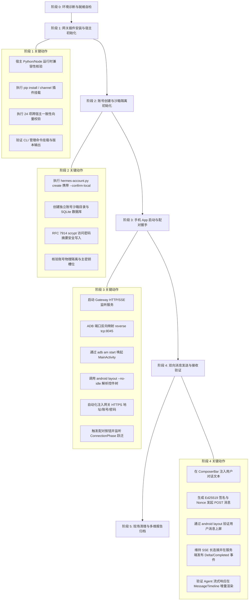
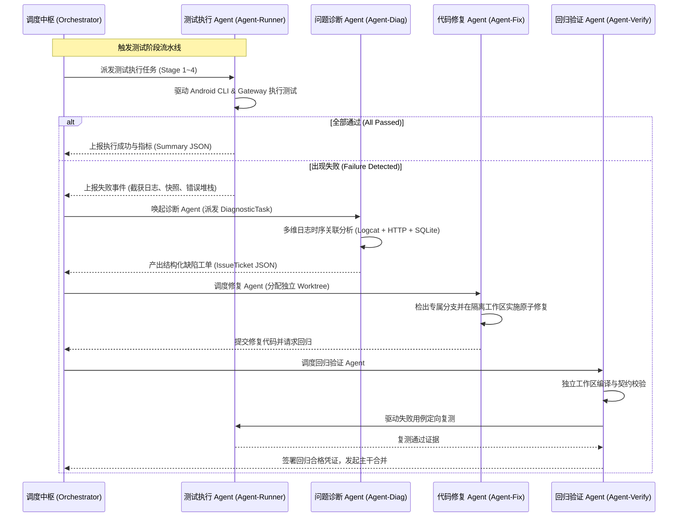
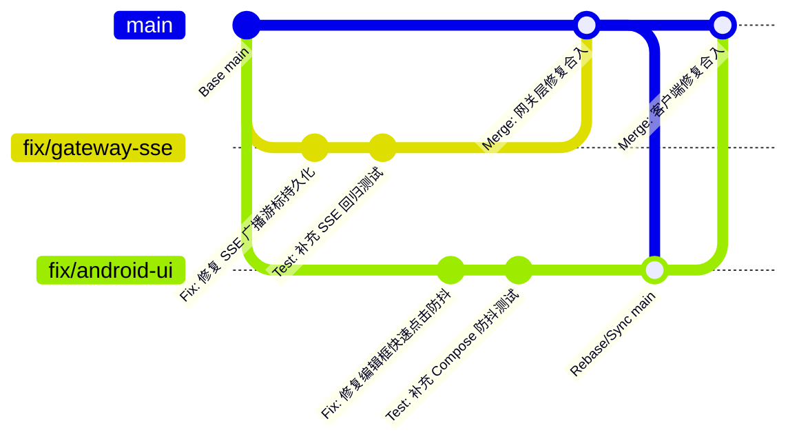
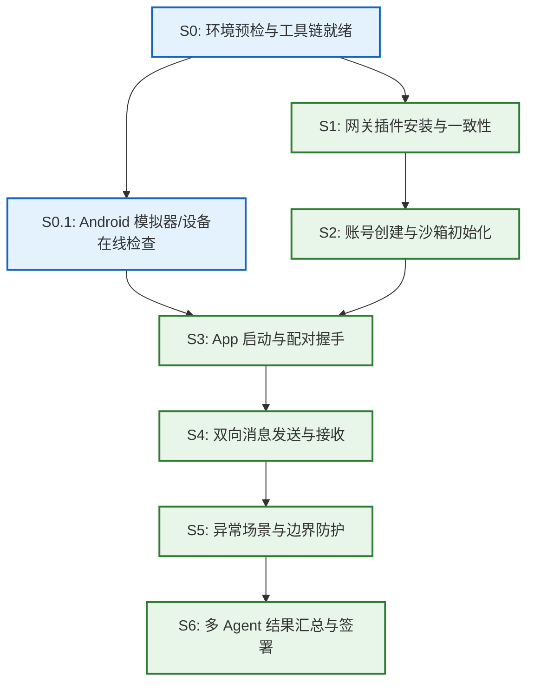

# 基于 Android CLI 工具的端到端测试与多 Agent 协同调度方案

- **状态**: 现行规范 (Active Specification)
- **生效日期**: 2026-09-14
- **所属架构**: Gateway Protocol v2 / 模块化插件架构 (`docs/superpowers/specs/2026-08-24-modular-plugin-architecture.md`)
- **适用范围**: Agent 宿主网关插件 (Hermes / OpenClaw)、Android 平台内核与可见核心、端到端自动化测试套件与多 Agent 分布式调度系统

---

## 1. 架构背景与设计目标

### 1.1 背景与系统边界
根据《Open Android Intelligence 模块化插件架构规格》（ADR 0001 ~ ADR 0047），系统彻底移除了早期基于单独 Docker/systemd 部署的独立 Bridge 方案，全面升级为由 Agent 宿主原生托管的 **Gateway Protocol v2**。
在此架构下：
1. **Agent 宿主侧**：Hermes（Python 原生插件）与 OpenClaw（TypeScript/JavaScript 渠道插件）提供协议网关实现，负责多账号数据物理隔离（SQLite 沙箱）、会话协商、双向消息路由、附件加密暂存与服务端审计；
2. **Android 宿主侧**：保持可见核心最小化（仅包含账号/网关管理、对话时间线与附件操作），通过原生平台内核（Platform Kernel）管控安全原语与受保护插件（`.alp` / WASM）隔离；
3. **连接与通信**：基于 HTTPS 握手认证与 Server-Sent Events (SSE) 事件流，不依赖任何第三方云端中继或中心化服务。

### 1.2 端到端测试的核心挑战
由于涉及“宿主插件运行环境 ➔ 本地账号与加密沙箱 ➔ Android 模拟器/实机网络握手 ➔ 跨进程/跨端双向流式通信”等多个物理与逻辑边界，传统的单一单元测试或桩代码（Mock）测试无法验证真实系统闭环。必须建立一套**完全基于官方 Android CLI 工具链**驱动的真实端到端（E2E）自动化测试与调度框架，并引入**多 Agent 协同体系**，实现“自动化执行 ➔ 智能故障诊断 ➔ 多 Git Worktree 并行修复 ➔ 回归验证与主干集成”的全自动化工程闭环。

---

## 2. 第一阶段至第四阶段完整测试流程与关键操作步骤

端到端测试全流程分为四个串行核心业务阶段与两端生命周期钩子（环境预检与现场清理）：



### 2.1 阶段一：网关插件安装与宿主初始化 (Gateway Plugin Installation)
1. **宿主环境预检**：
   - 验证 Python 运行时（Python ≥ 3.12）或 Node.js 运行时（Node ≥ 24.18.0）；
   - 核验宿主版本范围是否符合声明（如 Hermes API 1.0.0 ~ 3.0.0）；若宿主超出范围，依协议规范自动进入 `HOST_INCOMPATIBLE` 只读冻结状态。
2. **插件安装与加载**：
   - Hermes 宿主：执行 `pip install -e integrations/hermes` 或安装编译完成的 Wheel 单文件；
   - OpenClaw 宿主：通过渠道插件注册机制引入 `integrations/openclaw`。
3. **规范一致性套件校验**：
   - 执行 `npm run gateway:v2:conformance`，运行跨宿主测试套件；
   - 必须通过全量 24 个标准化协议向量测试（包括 Target 规范化排序、Ed25519 签名验证、握手协商 Schema 校验、SSE 消息模式与防重放规则），两端 SHA-256 结果指纹必须 100% 绝对一致。
4. **管理 CLI 注册验证**：
   - 执行 `./hermes-account.py status` 或 `hermes open-android-intelligence status`，确认子命令正常注入且返回当前网关就绪信息。

### 2.2 阶段二：账号创建与沙箱隔离初始化 (Account Provisioning & Sandbox Isolation)
1. **本地显式确认创建账号**：
   - 测试调度脚本调用：
     ```bash
     ./hermes-account.py create e2e_test_phone --confirm-local
     ```
   - 必须显式携带 `--confirm-local`（或交互式向导中的本地操作员确认），禁止通过远程未经授权的 HTTP 请求触发自注册（遵循 ADR 0030/0031）。
2. **沙箱物理目录分配**：
   - 网关 Core 为该账号生成唯一稳定的 `accountId`；
   - 在独立存储沙箱（如 `~/.hermes/open_android_intelligence_storage/accounts/<accountId>/`）下创建物理隔离区：
     - SQLite 协议数据库：`gateway.sqlite`（单独应用 migration 脚本，创建会话表、配对表、游标事件表、防重放表）；
     - 加密凭证存储：写入派生密码 Hash，严禁明文落地；
     - 附件暂存目录：`attachments/staged/`（仅用于传输中转，设置严格的生命周期清理规则）；
     - 独立审计日志：`audit.log`。
3. **账号隔离断言**：
   - 校验文件权限为 `0700`，确认宿主未在不同账号间复用数据库连接或共享数据表。

### 2.3 阶段三：手机 App 启动与配对握手 (App Launch & Pairing Handshake)
1. **网关服务监听与网络打通**：
   - 启动网关服务监听端口（默认 `127.0.0.1:8045`）；
   - 在 Android 模拟器/实机环境下，执行 `adb reverse tcp:8045 tcp:8045`，使 Android 设备内通过 `https://127.0.0.1:8045` 或 `https://10.0.2.2:8045` 直达网关服务。
2. **Android 宿主应用启动**：
   - 执行命令冷启动 App：
     ```bash
     adb shell am start -n com.openandroidintelligence.mobile/.MainActivity
     ```
3. **Android CLI 控件树分析与表单注入**：
   - 调用 `android layout --no-idle` 获取当前屏幕的可交互节点树（JSON 格式）；
   - 解析得到 `网关地址`、`用户名 / 账号`、`访问凭据 / 密码` 的输入框中心坐标；
   - 依次执行点击聚焦与文本输入：
     ```bash
     adb shell input tap <gateway_input_center_x> <gateway_input_center_y>
     adb shell input text "https://10.0.2.2:8045"
     adb shell input tap <account_input_center_x> <account_input_center_y>
     adb shell input text "e2e_test_phone"
     adb shell input tap <password_input_center_x> <password_input_center_y>
     adb shell input text "TestSecretPassword2026!"
     ```
4. **配对握手触发与状态跃迁断言**：
   - 点击“连接至网关”按钮；
   - 客户端内部状态机流转：`ConnectionPhase.Disconnected` ➔ `ConnectionPhase.Negotiating`（协商协议主次版本 2.0） ➔ `ConnectionPhase.Authenticating`（提交初始密码会话请求与设备公钥） ➔ `ConnectionPhase.Connected`；
   - 网关完成身份认证并签发短期 `sessionId` 与持久化刷新凭据；Android Keystore 锁定私钥；
   - Android 界面跃迁进入主工作台 `WorkbenchScreen`，顶部状态栏呈现网关连接地址。

### 2.4 阶段四：双向消息发送与接收 (Bidirectional Messaging & SSE Streaming)
1. **用户端消息上行 (Client Inbound)**：
   - 使用 `android layout --no-idle` 定位 `ComposerBar` 输入栏；
   - 聚焦并注入测试文本：`adb shell input text "Hello%sAgent%sE2E%sTest"`；
   - 定位并点击“发送”按钮；
   - 客户端后台组装网关请求，计算单调请求 ID、时间戳、16字节随机 Nonce，并使用 Android 端设备私钥生成 Ed25519 签名；
   - 客户端发出 `POST /open-android-intelligence/v2/conversations/{id}/messages`；
   - 验证输入栏自动清空，时间线中立即上屏“发送中/已发送”的用户气泡。
2. **服务端事件下行推送 (SSE Streaming & Assistant Outbound)**：
   - 网关适配器截获输入消息，触发 Agent 会话 Turn；
   - 网关将 Agent 回复存入事件表，并通过 `GET /open-android-intelligence/v2/events` SSE 通道广播 `conversation.message.delta` 与 `conversation.message.completed`；
   - Android 客户端解析 SSE 数据帧，在 `MessageTimeline` 中实时渲染流式打字机效果并最终定稿。

---

## 3. 各阶段成功标准与量化验证指标

为保证端到端测试客观可衡量，各阶段设定如下验收矩阵：

| 测试阶段 | 核心指标项 | 验证方式与抓手 | 达标门槛 (Pass Criteria) |
|---|---|---|---|
| **阶段 1: 插件安装** | 依赖就绪与安装码 | `pip show` / `npm list` | 返回码为 0，无未解决版本冲突 |
| | 跨宿主契约一致性 | `npm run gateway:v2:conformance` | 24/24 PASS，结果哈希两端 100% 吻合 |
| | 管理 CLI 接口连通 | `hermes-account.py status` | 输出 `ok: True, readOnly: False` |
| **阶段 2: 账号创建** | 账号初始化状态 | CLI 返回 JSON 结构 | 包含明确 `accountId`，返回码为 0 |
| | 物理沙箱隔离 | 检查文件系统目录与权限 | 沙箱权限为 `0700`，存在独立 `gateway.sqlite`，无跨账号泄露 |
| | 密码校验防篡改 | 验证器比对正确/错误密码 | 正确密码返回 True，篡改/错误密码 100% 拒绝 |
| **阶段 3: 配对握手** | HTTP 协商响应码 | 网关日志 / 网络抓包 | `/negotiate` 返回 200，固定协议版本 2.0 |
| | 认证与会话创建 | 网关响应体校验 | 返回有效 `sessionId`, `deviceId`, `accessToken` |
| | 界面状态跃迁 | `android layout --no-idle` | 离开登录页，主工作台顶部正确呈现网关 URL |
| | 配对端到端时延 | 客户端性能时戳差值统计 | 本地回环网络下握手耗时 **≤ 1500 ms** |
| | 安全凭据落盘 | Android 私有存储巡检 | 设备密钥存入 Keystore，无明文密码落地 |
| **阶段 4: 消息收发** | 消息投递成功率 | 网关数据库入库记录 | 上行消息发送成功率 **100%** |
| | 消息上行确认延迟 | 发送点击至网关返回 200 | 时延 **≤ 200 ms** |
| | SSE 下行首包延迟 | 首个 `delta` 推送至界面渲染 (TTFT) | 时延 **≤ 800 ms** |
| | 完整响应达成时延 | `completed` 事件完成渲染 | 完整回复时间 **≤ 3000 ms**（模拟 Agent） |
| | 防重放与防篡改 | 构造重复 Nonce 或篡改签名测试 | 网关返回 400/401 拦截率 **100%** |
| | 界面无崩溃无 ANR | `adb logcat -b crash -d` | 零崩溃记录，UI 线程掉帧不触发 ANR |

---

## 4. 多 Agent 协同架构、职责分工与协作机制

为了将自动化测试的发现、排查与修复流程标准化，建立由主调度器（Orchestrator）协调的四大 Agent 角色体系：



### 4.1 四大 Agent 职责分工

1. **测试执行 Agent (`Agent-Runner`)**：
   - **职责**：负责测试环境就绪确认、网关进程拉起、驱动 Android CLI 工具执行自动化 Journey 动作、采集全流程证据（UI 布局 JSON、屏幕 PNG 快照、logcat 日志、性能耗时指标）。
   - **输入**：测试清单（`TestPlanManifest`）、测试目标 APK、网关配置。
   - **输出**：结构化运行结果（`*.result.json`）、截图集与耗时矩阵。

2. **问题诊断 Agent (`Agent-Diag`)**：
   - **职责**：监听测试失败事件；跨界提取 Android logcat、网关应用日志、SQLite 状态与系统事件，完成时序对齐分析；判断缺陷归属模块（Android Compose UI、Gateway Client、Platform Kernel、Hermes Adapter、协议 Schema 契约）；评估故障严重等级（P0 阻断、P1 严重、P2 一般）。
   - **输出**：标准格式缺陷工单 `DiagnosticTicket`（包含故障指纹、重现命令、关键证据路径与建议修复接缝）。

3. **代码修复 Agent (`Agent-Fix`)**：
   - **职责**：响应缺陷工单；在分配的独立 Git Worktree 中检出分支；根据架构约束与契约规范编写修复代码；编写防倒退单元测试。
   - **约束**：严禁侵入未授权模块；严禁使用临时伪造实现或死状态；保证代码修改原子性。

4. **回归验证 Agent (`Agent-Verify`)**：
   - **职责**：在隔离 Worktree 运行模块本地测试；触发一致性套件与静态检查门禁；验证通过后通知 `Agent-Runner` 重新执行关联端到端 Journey；确认通过后执行分支合并，并向主调度器同步修复闭环状态。

### 4.2 调度策略与触发条件

- **串行调度规则（强依赖阶段）**：
  - “插件安装 ➔ 账号初始化 ➔ 握手配对 ➔ 消息收发”构成严格因果依赖链；
  - 任何前置阶段失败，主调度器立即**熔断当前流水线**，停止后续阶段的无意义执行，直接触发 `Agent-Diag`；
- **并行调度规则（解耦故障分析与修复）**：
  - 当流水线在测试矩阵（如异常用例组 EXC-01~08）中检出多个**跨独立子系统的问题**时（例如：Android UI 端输入防抖缺陷 EXC-05 与 网关端断网游标恢复缺陷 EXC-08），主调度器**并行派发两个 `Agent-Diag` 实例**分别分析；
  - 随后并行分配两个独立 Git Worktree，派发两个 `Agent-Fix` **并行实施代码修复**；
- **合并与回归互斥锁（Gate Mutual Exclusion）**：
  - 并行修复完成后，合并回主分支（`main`）必须**串行排队**；每次合并必须执行依赖锁检查与完整 Smoke 测试，防止主干冲突与逻辑漂移。

### 4.3 协作机制与状态同步协议

Agent 间基于统一的状态文件 `orchestrator_state.json` 与 Ticket 契约协议交接：
```json
{
  "ticketId": "TICKET-20260914-001",
  "phase": "PHASE_3_PAIRING_HANDSHAKE",
  "severity": "P0",
  "errorType": "HANDSHAKE_TIMEOUT",
  "rootCauseModule": "apps/android/gateway-client",
  "reproCommand": "python3 e2e/android-cli/run-e2e-orchestrator.py --stage pairing",
  "evidence": {
    "screenshot": "artifacts/test-runs/.../screenshots/MOD-01.png",
    "logcat": "artifacts/test-runs/.../logs/MOD-01.logcat",
    "gatewayLog": "artifacts/test-runs/.../logs/gateway.log"
  },
  "assignedAgent": "Agent-Fix-01",
  "worktreePath": ".worktrees/e2e-fix-handshake-timeout",
  "branchName": "fix/e2e-pairing-handshake-timeout",
  "status": "IN_PROGRESS"
}
```

---

## 5. 典型问题排查手册与自动定位修复流程

### 5.1 典型问题一：网关插件安装与一致性校验失败
- **故障现象**：
  - 执行 `pip install -e integrations/hermes` 抛出构建异常；或 `npm run gateway:v2:conformance` 报告某项向量（如 `request-signature-oracle`）哈希不匹配，测试终止。
- **排查定位抓手**：
  - 检查 Python/Node 运行时依赖版本是否在 `engines` 许可区间；
  - 运行 `python3 -c "import open_android_intelligence_gateway"` 查看具体 `ModuleNotFoundError`；
  - 检查 `gateway-contract/vectors/` 下对应 JSON 向量，对比两端序列化结果（如 Canonical JSON 排序规则、换行符或浮点数格式）。
- **定位与修复流程**：
  1. `Agent-Diag` 提取一致性失败的 Diff 输出，定位到不一致的具体字段或编解码环节；
  2. `Agent-Fix` 介入，修改适配器中的规范化代码（例如 `canonicalize_target` 或 `request_signature_preimage`）；
  3. 在独立工作区复测 `npm run gateway:v2:conformance` 直至 24/24 PASS。

### 5.2 典型问题二：配对握手超时 / 拒绝 (Handshake Failure / Timeout)
- **故障现象**：
  - Android 客户端点击“连接至网关”后，界面持续停留在“正在协商协议版本…”或“正在验证凭据…”，超过 10 秒后显示“连接网关失败”；或者网关直接返回 HTTP 401 `AUTHENTICATION_FAILED`。
- **排查定位抓手**：
  - **网络连通层**：执行 `adb shell ping 10.0.2.2` 或 `adb shell curl -k https://10.0.2.2:8045/health`，排查 ADB reverse 端口映射是否断开；
  - **网关认证层**：查看网关输出日志，确认请求是否因时钟偏差（Clock Skew > 300s）被拦截；
  - **凭证核验层**：检查沙箱 SQLite 中是否有该账号记录，密码哈希对比是否通过；检查 Android 设备公钥格式是否为合法的 32 字节 Ed25519 公钥。
- **定位与修复流程**：
  1. `Agent-Diag` 通过时序关联分析锁定问题所在（若网关完全无收到请求日志，则为 ADB/网络路由故障；若收到并返回 400，则为参数/签名校验故障）；
  2. 若为网络端口映射缺失，`Agent-Runner` 自动重置 ADB 转发规则并重启握手；
  3. 若为公钥编码或签名计算偏差，`Agent-Fix` 在 `apps/android/gateway-client` 修正签名 Preimage 拼接算法。

### 5.3 典型问题三：消息丢失与 SSE 长连接断连 (Message Loss & SSE Drop)
- **故障现象**：
  - Android 端点击发送后，UI 输入框已清空，但经过 10 秒仍未收到 Agent 的任何回复；或提示“事件连接中断”。
- **排查定位抓手**：
  - **上行确认**：检查网关日志是否包含 `POST /conversations/{id}/messages` 且返回 200；
  - **SSE 通道**：检查 `GET /events` 连接状态，确认 Android 客户端连接时的 `Last-Event-Id` 游标值；
  - **事件发布**：检查网关端 `_publish_event` 是否成功将 `conversation.message.delta` 写入账号数据库；
  - **Logcat 追踪**：过滤 `GatewayEventStream` 日志，排查是否有 `ReadTimeoutException` 或 JSON 反序列化解析崩溃。
- **定位与修复流程**：
  1. `Agent-Diag` 判定是“上行未入库”、“服务端未派发事件”还是“下行 SSE 丢包”；
  2. 若为 SSE 解析协议字段缺失（例如漏传 `messageId`），`Agent-Fix` 修复网关 `_message_payload` 字段结构；
  3. 若为偶发网络断连，`Agent-Fix` 检查 Android 端指数退避重连机制与带游标重放逻辑（Cursor Replay）。

---

## 6. 多 Git Worktree 并行修复、分支管理与合并策略

为了支持多 Agent 并发处理不同缺陷且杜绝代码污染与构建竞态，采用 **Git Worktree 隔离开发体系**。



### 6.1 Worktree 目录拓扑与生命周期
1. **工作区目录隔离**：
   - 统一建立在项目根目录 `.worktrees/` 目录下（该目录已在 `.gitignore` 保护名单内）：
     - `.worktrees/e2e-fix-gateway/`
     - `.worktrees/e2e-fix-android-client/`
     - `.worktrees/e2e-fix-contract/`
2. **生命周期规范**：
   - **创建**：由主调度器通过 `git worktree add -b fix/e2e-<ticket_id> .worktrees/e2e-fix-<ticket_id> main` 创建；
   - **隔离构建**：各 Worktree 内独立运行 Gradle/Python/Node，避免构建缓存与锁文件竞争；
   - **清理**：缺陷验证通过并成功合入主干后，通过安全流程将临时 worktree 移除（遵循 `AGENTS.md` 文件规范，严禁直接执行高危永久删除命令）。

### 6.2 分支管理与提交规范
- **分支命名格式**：`fix/e2e-<阶段代号>-<简要缺陷描述>`
  - 示例：`fix/e2e-S3-handshake-clockskew`、`fix/e2e-S4-sse-cursor-replay`
- **提交说明规范**：必须严格遵循 `AGENTS.md` 规定的**中文提交说明**：
  - 格式：`修复: 解决 Android 登录握手时钟偏差导致的配对超时问题`
  - 必须包含对应的工单代号与修改原因。

### 6.3 冲突预防与合并拓扑顺序
为了降低代码冲突并保持架构一致性，合并执行严格的**依赖分层拓扑顺序**：
1. **第一优先级：契约层 (Contracts)**
   - 涉及 `gateway-contract/` 或 `docs/contracts/` 的修改必须首先合并，并同步生成一致性测试哈希；
2. **第二优先级：网关适配层 (Gateway Integrations)**
   - 合并 Hermes / OpenClaw 适配器代码并确保通过最新契约测试；
3. **第三优先级：客户端内核与 UI 层 (Android Platform Kernel & Apps)**
   - 合并 Android 客户端修复，并基于已更新的网关契约执行联调；
4. **第四优先级：测试资产与执行套件 (Journeys & E2E Suites)**
   - 合并自动化用例与测试清单。

合并时必须在对应 Worktree 内先执行 `git rebase main`，确保分支线性提交，杜绝污染主干。

---

## 7. 整体执行顺序、阶段依赖关系与最终结果汇总

### 7.1 阶段执行依赖有向无环图 (DAG)



### 7.2 阶段流转控制表

| 执行序号 | 阶段标识 | 依赖前置阶段 | 失败策略 | 对应自动化执行入口 |
|:---:|:---:|:---:|:---:|:---|
| **01** | `ENV_READY` | 无 | 立即阻断 | `prepare_environment.sh` |
| **02** | `PLUGIN_INSTALL` | `ENV_READY` | 熔断流水线并触发 Diag | `pip install -e` + `npm run gateway:v2:conformance` |
| **03** | `ACCOUNT_PROVISION` | `PLUGIN_INSTALL` | 熔断流水线并触发 Diag | `./hermes-account.py create` |
| **04** | `PAIRING_HANDSHAKE` | `ACCOUNT_PROVISION` + `ENV_READY` | 熔断流水线并触发 Diag | `android layout` + 表单注入 + 登录点击 |
| **05** | `BIDIRECTIONAL_MSG` | `PAIRING_HANDSHAKE` | 派发 Diag 分析上/下行 | `android layout` + 消息发送 + SSE 监听 |
| **06** | `ABNORMAL_DEFENSE` | `BIDIRECTIONAL_MSG` | 记录缺陷并并行修复 | 执行 EXC-01 ~ EXC-08 异常用例 |
| **07** | `REPORT_SUMMARY` | 全部完成 | 产出终审报告并归档 | 自动生成 Markdown 报告与 JSON 汇总 |

### 7.3 最终结果汇总与交付格式

测试流水线执行完毕后，主调度器在 `artifacts/test-runs/<timestamp>/` 统一归档四类标准产物：
1. **结构化汇总数据 (`e2e_summary.json`)**：
   记录批次 ID、测试环境硬件/软件配置、各阶段起止时间、耗时、PASS/FAIL 状态、性能延迟指标分位数。
2. **多 Agent 缺陷与修复清单 (`issue_resolution_matrix.json`)**：
   包含本次运行检出的问题数量、诊断工单、分配的 Worktree 分支、代码修复 Commit 以及验证结果状态（`RESOLVED` / `PENDING`）。
3. **关键证据链索引**：
   - 屏幕快照（`screenshots/*.png`，含登录成功主工作台界面、消息发送后时间线渲染界面）；
   - 设备 Logcat 捕获与网关控制台全量日志（`logs/*.logcat`, `logs/gateway.log`）。
4. **终审测试总结报告 (`e2e_orchestration_report.md`)**：
   面向工程团队与操作员的 Markdown 报告，清晰展现通过率、核心时延达标情况、异常防护有效性及系统上线签署意见。

---

## 8. 总结与落地指南

本测试方案严格遵照 Open Android Intelligence 核心架构原则：
1. **绝对杜绝伪造数据与死状态**：全部测试操作均由真实的 Android CLI 控件树注入驱动，网络通信经过真实的 TLS/HTTPS 与 SSE 协议栈，账号与消息严格持久化至 SQLite 数据库；
2. **端到端完整闭环**：从插件安装、账号配置、配对握手到双向通信全链路串联；
3. **多 Agent 生产级自治**：具备完备的故障自动诊断、Git Worktree 并发隔离修复与门禁合并回归能力，为系统持续演进提供了坚不可摧的质量防护盾。

